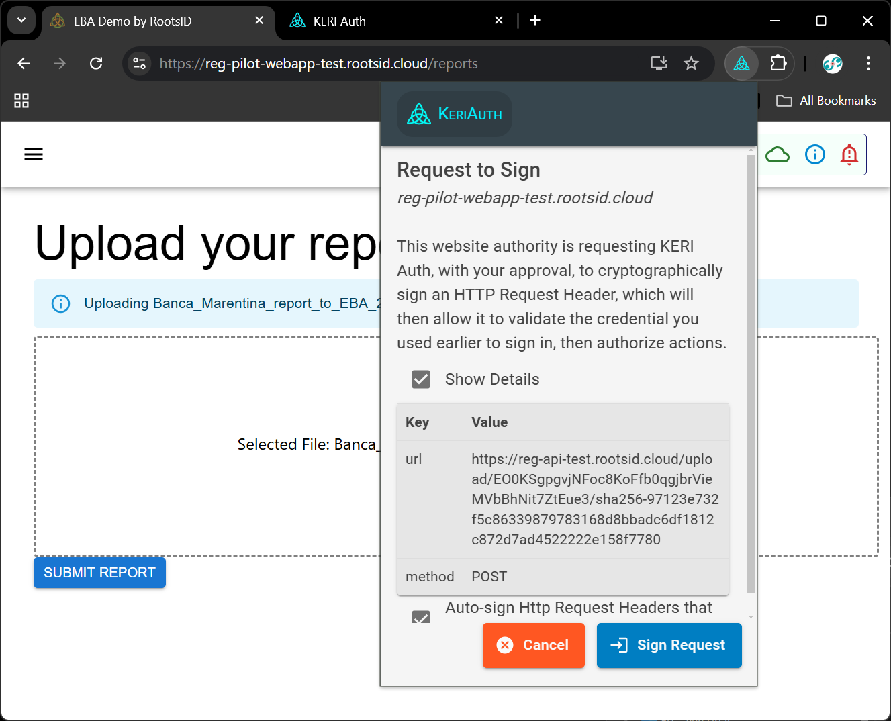

# KERI Auth Product Install and Happy Path Testing

## A. Download a test report
1. Download a test report, which you will later upload and submit
    1. From a browser tab, download the [Banca_Marentina_report_to_EBA_2024-12-31.zip](./Reports/Banca_Marentina_report_to_EBA_2024-12-31.zip), and store it locally.

## B. Product Install

1. Install KERI Auth extension
    1. Open a Chrome browser
    1. Install the KERI Auth Extension, following one of these options:
        1. Navigate in the Chrome Web Store to the current release, here: https://chromewebstore.google.com/detail/keri-auth/jidldhmnhdelhfcfmlhdojkfgcbalhhj and click on Add to Chrome.  Acknowledge the warning on “Add KERI Auth?” and press “Add extension”
        1. Or, if you want an unsigned pre-release, use the build-artifacts link here: https://github.com/KERIAuth/keriauth-blazor-wasm/actions/runs/12354002582    and unzip that download and the KeriAuth.zip file within it. In Chrome, you'll need to navigate to Manage Extensions, enable Developer Mode, then press Load Unpacked.

1. Follow the onboarding UX pages in KERI Auth
    <!-- Updated Release -->
                        

    <!-- Terms -->
    

    <!-- Accept Terms -->
    

1. On the Configure Screen
    1. Select the Preset “Roots ID”
    1. Clear the Boot URL string
    1. Copy/paste the “Demo signify passcode” found on this page: https://github.com/GLEIF-IT/reg-pilot?tab=readme-ov-file
    1. Press Connect

    <!-- Configure -->
    

1. You’ll now see this Dashboard screen:

    <!-- Home -->
    

1. You may explore features via the menu

## C. Pin the KERI Auth extension action icon

1. From the browser extension icon area, pin the KERI Auth action button

    <!-- action icon pin -->
    

## D. Navigate to and test the Reg-Pilot-Webapp

1. From the current browser tab or a new one, navigate to (https://reg-pilot-webapp-dev.rootsid.cloud/)

1. Click on Select Credential button

1. If needed, click on the KERI Auth action icon and refresh the page just opened

1. When seeing the popup, if it is locked, you may need to 

    1. Enter the same passcode as earlier.
    1. Press Unlock.

    <!-- Unlock in Popup -->
    

1. Select the Identifier called “role” and the second credential on the list:
    <!-- Request to Sign In -->
    

1. Press Sign In. 
    * If you see a spinning cursor, the website has timed out. You’ll need to refresh the page and repeat these steps above.
    * A successful interaction should result in the following:

    <!-- success after Sign In -->
    

1. Navigate to Reports

1. Back on the reg-pilot-webapp-test page, press SELECT FILE or drag and drop the zip file you just downloaded.

1. Press SUBMIT REPORT

    * (If you get an error like [Object object], the website has timed out, and you’ll need to refresh the tab and re-start the flow from https://reg-pilot-webapp-test.rootsid.cloud/ )

<!-- request to sign POST -->

      

<!-- 
1. Prepare dependant components to use KERIA to use KERIA and https://reg-pilot-webapp-dev.rootsid.cloud/ hosted by RootsID.  Contact Ed Eykholt privately if you’d like this passcode.  
1. Install your own following: https://github.com/GLEIF-IT/reg-pilot/tree/main/signify-ts-test  which has docker-compose, test data generation, tests, etc. and here which has webapp based testing, test data, etc https://github.com/GLEIF-IT/reg-pilot-webapp/tree/main/my-app 
-->

