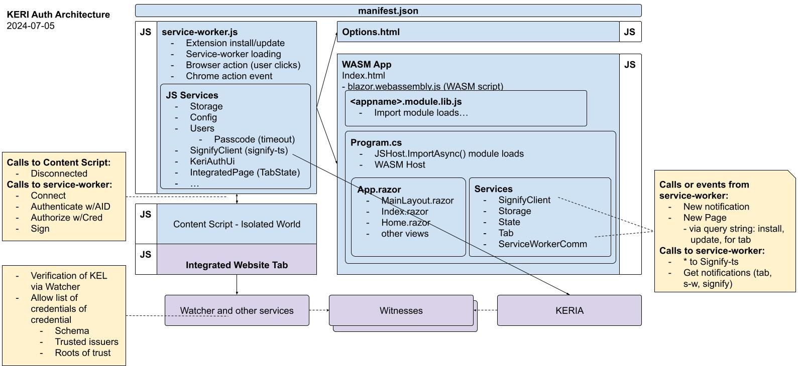

# KERI Auth Browser Extension

](https://github.com/keriauth/keriauth-blazor-wasm/actions/workflows/dotnet.yml)

## Summary
This extension removes a class of problems website owners have with managing usernames and passwords or relying on federated identity providers that risk leaking or correlating user usage patterns. 

The primary goal of this extension is to provide a highly secure way to authentically "sign in" to certain websites. The browser extension under development will enable a user to interact with conforming websites, to *authenticate* with the user’s KERI identifier and to *authorize* with an ACDC credential they’ve been issued. 

Its passwordless design enables the user to create and manage their own stable identifiers (KERI AIDs), signing keys, and credentials. It utilizes credentials issued by the website owners and/or other issuers they trust.

The browser extension, implemented for Chromium browsers, uses the [WebOfTrust/signify-ts](https://github.com/weboftrust/signify-ts) component to connect with an instance of [KERIA](https://github.com/weboftrust/keria), a KERI cloud agent, which safely manages the user’s AIDs, associated keys, credentials, and other services. The user can choose whether they host a KERIA instance themselves or use one provided by a third party.

## Contents
- [Architecture](#architecture) 
  - [Service-worker](#service-worker)
  - [Browser Extension Action Icon/Button](#browser-extension-action-iconbutton)
  - [Content Script](#content-script)
  - [Integrated Web Page](#integrated-web-page)
  - [Blazor WASM Components](#blazor-wasm-components)
    - [Single Page App](#single-page-app)
    - [Views](#views)
    - [Services](#services)
- [Security considerations](#security-considerations)
- [Run for development](#run-for-development)
- [Roadmap](#roadmap)
- [Installation](#installation)
- [Usage](#usage)
- [Configuration](#configuration)
- [Development Setup](#development-setup)
- [Contributing](#contributing)
- [License](#license)
- [Acknowledgments](#acknowledgments)
- [Contact Information](#contact-information)
- [Community](#community)
- [References](#references)

## Architecture

Figure: KERI Auth Browser Extension Architecture ([source](https://docs.google.com/drawings/d/1xICKkvaJkS4IrOGcj_3GidkKHu1VcIrzGCN_vJSvAv4))
<!-- The browser extension is composed of the following components: -->

### Manifest.json
* Describes the extension and its permissions.

### Browser Extension Action Icon/Button
* Action button and its context menu appear after install in the upper-right corner of the browser.
* Action Icon or its overlay text may change depending on state or awaiting notifications.
* Used to indicate the user’s intent and permission to interact with the current browser page.

### Service-worker
* Runs background tasks.
* Sends and handles messages to/from the integrated webpage via injected content script.
* Sends and handles messages to/from the WASM components.
* Persists configuration via chrome.storage.local.
* Communicates with KERIA agent via signify-ts library.

### Content Script Context
* With the user’s permission this script is injected into the active web page after the user initiates the action.
* Handles messages to/from the website via a JavaScript API that the web page also implements.
* Handles messages to/from the service-worker.

### Integrated Web Page
* Provided by a website owner, leveraging interfaces on the Content Script.
* Interacts with extension via content script to get user's choice of AID and Credential.
* Responsible for validating and determining acceptance of presented AID and Credential.

### Blazor WASM Components

#### Single Page App (index.html)
* Program and page that run in browser WASM when any non-trivial extension UI is visible.
* Includes services and views.

#### Views (via App.razor)
* May appear as a popup (typically) or in a full tab.

#### Services
* Interact with service-worker (and indirectly the webpages) via messages.
* Communicates with KERIA agent via signify-ts library.
* Persists configuration and notifications via chrome.storage.local.

### Design security considerations
The following rules are enforced by design to ensure the security of the extension:
* Only sends signed headers to the website if the user has previously created a signing association with that website.
* Only sends signed headers to the website if the website is the active tab on the browser.
* Caches the passcode only temporarily and clears from cache after a few minutes.
* Only accepts content script messages from the active tab website, during authentication or after a signing association exists with the auto-authenticate flag enabled.
* Declare minimum required and optional permissions in its manifest.
* Never runs dynamic or inline scripts.
* Assures all sensitive data never reaches the content script or website.

# Roadmap
The goals for KERI Auth Brower Extension will evolve and may include interoperability with other KERI-related extensions and website JavaScript APIs. The high-level backlog and roadmap will be shown on https://keriauth.com, and details in GitHub Issues

## Install Prerequisites
* Run or get access to a KERIA instance. See [KERIA README](https://github.com/WebOfTrust/keria/blob/main/README.md). Run test suites
* **TBD**

## Development Setup and Build
**TBD** Instructions for setting up a development environment:
- Prerequisites (Node.js, npm, browser development tools, etc.).
- Cloning the repository and building the extension.
- Running tests.

## Extension Installation
**TBD** Step-by-step instructions for installing the extension:
- From a public repository (like Chrome Web Store).
- From the source code via `load unpacked` in developer mode.

## Usage
**TBD** add detailed instructions on how to use the extension, including:
- Key features and how to access them.
- Screenshots or GIFs to illustrate functionality.
- Typical workflows and use cases.

## Configuration
**TBD** Information on customizing the extension, if applicable:
- Configurable options.
- Instructions for changing settings.

<!-- 
## Contributing
Guidelines for contributing to the project:
- How to submit issues and pull requests.
- Coding standards and best practices.
- Code of conduct and community guidelines.
-->

## Acknowledgments
We especially appreciate the contributors of following libraries we use:
* [WebOfTrust/signify-ts](https://github.com/webOfTrust/signify-ts/) by WebOfTrust
* [mingyaulee/Blazor.BrowserExtension](https://github.com/mingyaulee/Blazor.BrowserExtension) by mingyaulee
<!-- TODO See acknowledgements file for other 3rd parties utilized -->

<!--
## Contact Information
Contact information for the project maintainer(s):
- Email, GitHub profiles, or social media links.
-->

## Community
Join the project's community on [Discord](https://discord.gg/Va79ag9RCw).

## References
### Articles
* [Sign and Verify with Signify & Keria](https://medium.com/finema/keri-tutorial-sign-and-verify-with-signify-keria-833dabfd356b)
* [Introduction to KERI](https://medium.com/finema/the-hitchhikers-guide-to-keri-part-1-51371f655bba)
* [Introduction to ACDC](https://medium.com/finema/the-hitchhikers-guide-to-acdc-part-1-4b3b3b3b3b3b)
### Repositories
* [WebOfTrust/signify-ts](https://github.com/WebOfTrust/signify-ts)
* [WebOfTrust/signify-browser-extension](https://github.com/WebOfTrust/signify-browser-extension)
* [cardano-foundation/cf-identity-wallet](https://github.com/cardano-foundation/cf-identity-wallet)
* [cardano-foundation/cf-poc-tunnel](https://github.com/cardano-foundation/cf-poc-tunnel)
